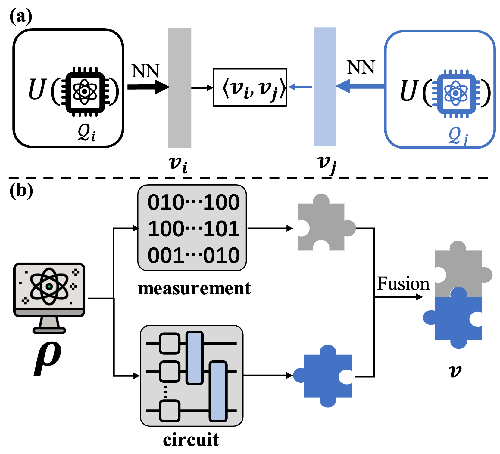

# Multimodal deep representation learning for quantum cross-platform verification

This repository is the official implementation of [*Multimodal deep representation learning for quantum cross-platform verification*](https://journals.aps.org/prl/abstract/10.1103/PhysRevLett.133.130601).

## Abstract

Cross-platform verification, a critical undertaking in the realm of early-stage quantum computing, endeavors to characterize the similarity of two imperfect quantum devices executing identical algorithms, utilizing minimal measurements. While the random measurement approach has been instrumental in this context, the quasiexponential computational demand with increasing qubit count hurdles its feasibility in large-qubit scenarios. To bridge this knowledge gap, here we introduce an innovative multimodal learning approach, recognizing that the formalism of data in this task embodies two distinct modalities: measurement outcomes and classical description of compiled circuits on explored quantum devices, both containing unique information about the quantum devices. Building upon this insight, we devise a multimodal neural network to independently extract knowledge from these modalities, followed by a fusion operation to create a comprehensive data representation. The learned representation can effectively characterize the similarity between the explored quantum devices when executing new quantum algorithms not present in the training data. We evaluate our proposal on platforms featuring diverse noise models, encompassing system sizes up to 50 qubits. The achieved results demonstrate an improvement of 3 orders of magnitude in prediction accuracy compared to the random measurements and offer compelling evidence of the complementary roles played by each modality in cross-platform verification. These findings pave the way for harnessing the power of multimodal learning to overcome challenges in wider quantum system learning tasks.



## Bibtex

```
@article{qian2024multimodal,
  title={Multimodal deep representation learning for quantum cross-platform verification},
  author={Qian, Yang and Du, Yuxuan and He, Zhenliang and Hsieh, Min-Hsiu and Tao, Dacheng},
  journal={Physical Review Letters},
  volume={133},
  number={13},
  pages={130601},
  year={2024},
  publisher={APS}
}
```